# Adopt-a-Pet: Cross-Modal Pet Search


Cross-modal pet search system using CLIP embeddings and Elasticsearch kNN. Search for adoptable pets by text description or by uploading a photo.

---

https://github.com/user-attachments/assets/55f045f4-2764-4c39-8a41-c6e4ae401b0e

> **Live demo**: [adopt-a-pet-577450633487.us-central1.run.app](https://adopt-a-pet-577450633487.us-central1.run.app) (full dataset, ~21,989 pets)
>
> ⏱️ **Note**: The first access after inactivity may take 10-15 seconds to load the CLIP model (~600 MB). Subsequent searches are instant (<1s).

Two deployment versions are available:
- **Local** (`main` branch): sampled dataset (~1,500 pets), Docker Compose with local Elasticsearch
- **Cloud** (`deploy` branch): full dataset (~21,989 pets), Cloud Run + Elastic Cloud + GCS

## Architecture

```mermaid
graph TB
    User[👤 User Browser]
    API[FastAPI + Jinja2<br/>Port 8000]
    Searcher[PetSearcher]
    CLIP[CLIPEncoder<br/>ViT-B-32, 512-dim]
    ES[Elasticsearch 8.x<br/>kNN dense_vector]

    User -->|Text query / Image upload| API
    API --> Searcher
    Searcher --> CLIP
    Searcher --> ES
    CLIP -->|encode_text<br/>encode_image| ES
    ES -->|text_embedding 512d<br/>image_embedding 512d| Searcher
```



### Search Flows

**Text Search** (e.g., "playful ginger cat"):

```mermaid
flowchart LR
    Q["🔍 Query: playful ginger cat"]
    CLIP[CLIP Text Encoder]
    V[512-dim vector]
    KNN1[kNN Query 1<br/>source: petfinder<br/>text boost=1.5]
    KNN2[kNN Query 2<br/>60% PF + 40% Oxford<br/>text boost=1.5]
    L[📋 Adoption Listings<br/>10 results]
    I[🖼️ Similar Images<br/>10 results]

    Q --> CLIP --> V
    V --> KNN1 --> L
    V --> KNN2 --> I
```



**Image Search** (upload a pet photo):

```mermaid
flowchart LR
    P[📷 Photo Upload]
    CLIP[CLIP Image Encoder]
    V[512-dim vector]
    KNN1[kNN Query 1<br/>60% PF + 40% Oxford<br/>image boost=2.0]
    KNN2[kNN Query 2<br/>source: petfinder<br/>image boost=2.0]
    I[🖼️ Similar Images<br/>10 results]
    L[📋 Adoption Listings<br/>10 results]

    P --> CLIP --> V
    V --> KNN1 --> I
    V --> KNN2 --> L
```



Each search returns two sections: **Adoption Listings** (PetFinder records with descriptions, breed, age, gender) and **Similar Pet Images** (from both PetFinder and Oxford-IIIT, labeled by source).

## Project Structure

```
adopt-a-pet/
├── src/
│   ├── config.py                  # Central configuration
│   ├── data/
│   │   ├── downloader.py          # Dataset download (Kaggle + HTTP)
│   │   ├── processor.py           # Process, sample, merge datasets
│   │   └── schemas.py             # Pydantic models (PetRecord, SearchResponse)
│   ├── embeddings/
│   │   └── clip_encoder.py        # CLIP text/image encoder
│   ├── search/
│   │   ├── es_client.py           # Elasticsearch connection
│   │   ├── indexer.py             # Index creation, bulk indexing
│   │   └── searcher.py            # kNN search engine (split results)
│   └── api/
│       ├── app.py                 # FastAPI app factory
│       ├── routes.py              # API routes + featured pets
│       └── templates/             # Jinja2 HTML templates (Tailwind CSS)
├── tests/                         # Test suite (85 tests, 9 test files)
├── docs/
│   └── technical_design.md        # Full technical design document
├── docker/
│   └── Dockerfile                 # Multi-stage Python 3.12 build
├── docker-compose.yml             # ES + App services
├── main.py                        # Single entry point (6-step pipeline)
├── pyproject.toml                 # Dependencies and tool config
└── .env.example                   # Environment variable template
```

## Quick Start

### Prerequisites

- **Python 3.12+** installed
- **Docker** installed and running
  - **Linux**: Ensure Docker daemon is running: `sudo systemctl start docker`
  - **Windows**: Docker Desktop will auto-start if not running
  - **macOS**: Docker Desktop must be running


### One-command launch

```bash
# Install uv (if not already installed)
curl -LsSf https://astral.sh/uv/install.sh | sh

# Install dependencies (creates .venv automatically)
uv sync

# Launch everything (auto-starts Elasticsearch via Docker)
uv run python main.py
```

`main.py` detects whether Elasticsearch is running. If it isn't, it starts it
automatically via `docker compose up -d elasticsearch`. On Windows, if Docker
Desktop is not running, it will launch it automatically and wait for the daemon
to be ready. Then it downloads the datasets, generates CLIP embeddings, indexes
them, and launches the web UI at **http://localhost:8000**.


### Full Docker Compose (app + ES in containers)

```bash
# Configure environment
cp .env.example .env
# Edit .env with your Kaggle credentials

# Launch both services
docker compose up

# Open http://localhost:8000
```

### Pipeline steps

`main.py` runs six steps in order:

| Step | Description | Skip flag |
|------|-------------|-----------|
| 1 | Ensure Elasticsearch is running (auto-start via Docker if needed) | `--no-docker` |
| 2 | Download PetFinder (Kaggle) and Oxford-IIIT datasets | `--skip-download` |
| 3 | Process and merge datasets into `PetRecord` objects | `--skip-index` |
| 4 | Generate CLIP embeddings (text + image) | `--skip-index` |
| 5 | Bulk-index documents into Elasticsearch | `--skip-index` |
| 6 | Launch FastAPI web UI | -- |

### CLI Options

```bash
uv run python main.py                       # Full pipeline
uv run python main.py --skip-download       # Use already-downloaded data
uv run python main.py --skip-index          # Skip embeddings + indexing (data already indexed)
uv run python main.py --no-docker           # Don't auto-start ES (manage it yourself)
uv run python main.py --port 9000           # Custom server port
uv run python main.py --host 127.0.0.1      # Custom server host
uv run python main.py --es-url http://...   # Custom Elasticsearch URL
```

## Deployment Versions

| Aspect | Local (`main` branch) | Cloud (`deploy` branch) |
|--------|-----------------------|-------------------------|
| Pets indexed | ~1,500 (sampled) | ~21,989 (full dataset) |
| Elasticsearch | Local Docker container (8.12.0) | Elastic Cloud (managed) |
| Image storage | Local filesystem (FastAPI StaticFiles) | Google Cloud Storage (GCS) |
| CLIP model | Downloaded at first run (~600 MB) | Pre-cached in Docker image |
| Build system | Local Python + Docker Compose | Cloud Build + Artifact Registry |
| URL | http://localhost:8000 | [adopt-a-pet-577450633487.us-central1.run.app](https://adopt-a-pet-577450633487.us-central1.run.app) |

## Data Sources

| Source | Local (sampled) | Cloud (full) | Content |
|--------|----------------|--------------|---------|
| [PetFinder.my](https://www.kaggle.com/c/petfinder-adoption-prediction) | ~1,000 | ~14,993 | Real adoption listings with descriptions, breed, age, gender, photos |
| [Oxford-IIIT Pet Dataset](https://www.robots.ox.ac.uk/~vgg/data/pets/) | ~500 | ~7,349 | Breed-labeled pet photos (37 breeds) with synthetic descriptions |

## Search Results

Each query returns two result sections:

- **Adoption Listings** (10 results): PetFinder records shown as horizontal cards with photo, name, breed, age, gender, and description. These are real adoption listings with detailed metadata.

- **Similar Pet Images** (10 results): Images from both PetFinder and Oxford-IIIT datasets, shown in a compact grid. Each image displays a **source badge** (PetFinder or Oxford) to label its dataset origin. Results are mixed using source-filtered kNN queries (60% PetFinder, 40% Oxford) to guarantee representation from both datasets.

## API Endpoints

| Method | Path | Description |
|--------|------|-------------|
| GET | `/` | Home page with text search, image upload, and featured pets |
| GET | `/search?q=friendly+cat&top_k=10` | Text search (HTML, returns listings + images) |
| POST | `/search/image` | Image upload search (HTML, returns images + listings) |
| GET | `/api/search?q=cat&top_k=10` | Text search (JSON API) |
| GET | `/health` | Health check (Elasticsearch connectivity) |

## Development

### Running Tests

```bash
uv run pytest tests/ -v --cov=src
```

85 tests across 9 test files covering: data processing, CLIP encoding, API routes, Elasticsearch indexing, schemas, search engine, configuration, and downloads. All external dependencies (Elasticsearch, CLIP model, Kaggle) are mocked for fast offline testing.

### Code Quality

```bash
uv run black src/ tests/
uv run isort src/ tests/
uv run ruff check src/ tests/
```

### Tech Stack

| Layer | Technology |
|-------|-----------|
| ML | open-clip-torch (ViT-B-32, LAION-2B pretrained), PyTorch, Pillow |
| Search | Elasticsearch 8.12.0 (kNN dense_vector, cosine similarity), elasticsearch-py 8.x |
| Web | FastAPI, Jinja2, Tailwind CSS (dark theme) |
| Data | pandas, Pydantic v2, Kaggle REST API |
| Testing | pytest (85 tests), httpx, pytest-cov |
| Infrastructure | Docker Compose (local), Cloud Run + Cloud Build + Elastic Cloud + GCS (cloud) |
| Packaging | uv, hatchling, pyproject.toml |

### Troubleshooting

| Problem | Solution |
|---------|----------|
| `Elasticsearch not available` | Docker Desktop starts automatically on Windows. If it fails, open it manually. If port 9200 is occupied, stop the other container with `docker stop <name>` |
| `Kaggle download failed` | Verify `KAGGLE_KEY` in `.env` is valid. Without it, only Oxford-IIIT data is used |
| Port 8000 already in use | Use `--port 9000` or stop the process on 8000 |
| ES client returns 400 | Ensure `elasticsearch` Python package is `<9` (pinned in pyproject.toml). Client 9.x is not compatible with ES 8.x |

## Design Decisions and Trade-offs

| Decision | Choice | Rationale |
|----------|--------|-----------|
| CLIP model | ViT-B-32 (LAION-2B) | Good balance of speed and quality; 512-dim vectors keep ES index small |
| Dual kNN with boosting | text_embedding + image_embedding per query | Text queries benefit from text-text alignment; image queries from image-image alignment |
| Source-filtered queries | Separate kNN queries per source | Guarantees representation from both PetFinder and Oxford datasets |
| Split results | Listings + Images sections | Matches the challenge spec: text -> listings + images; image -> images + listings |
| Elasticsearch (not FAISS) | ES 8.x native kNN | Required by challenge; also provides filtering, metadata storage, and scalability |
| CPU-only PyTorch | No CUDA in Docker | ~2 GB image vs ~5 GB with CUDA; sufficient for inference |

For the full technical design document, see [docs/technical_design.md](docs/technical_design.md).

## Contact

**Daniel Bello** -- daniel.bello1795@gmail.com

For questions, comments, or additional information about this project, feel free to reach out.
