# Technical Design Document: Adopt-a-Pet Cross-Modal Search

## 1. Overview

Adopt-a-Pet is a cross-modal search system that enables users to find adoptable pets through natural language text queries or image uploads. The system leverages CLIP (Contrastive Language-Image Pretraining) embeddings for unified text-image representation and Elasticsearch kNN for fast vector similarity search.

The system is deployed in two modes:
- **Local development** (`main` branch): ~1,500 sampled pets, Docker Compose with local Elasticsearch
- **Cloud production** (`deploy` branch): ~21,989 pets (full dataset), Google Cloud Run with Elastic Cloud and GCS

## 2. Architecture

```mermaid
graph TB
    User[👤 User Browser]
    API[FastAPI + Jinja2<br/>Port 8000]
    Searcher[PetSearcher]
    CLIP[CLIPEncoder<br/>ViT-B-32, 512-dim]
    ES[Elasticsearch 8.x<br/>kNN dense_vector]

    User -->|Text query / Image upload| API
    API --> Searcher
    Searcher --> CLIP
    Searcher --> ES
    CLIP -->|encode_text<br/>encode_image| ES
    ES -->|text_embedding 512d<br/>image_embedding 512d| Searcher
```



### Search Flows

**Text Search** (e.g., "playful ginger cat"):
1. User submits text query
2. CLIPEncoder.encode_text() produces a 512-dim vector
3. Two source-filtered kNN queries run in sequence:
   - **Adoption Listings**: kNN filtered to `source=petfinder` with text_embedding boost=1.5, image_embedding boost=1.0 (returns 10 results)
   - **Similar Images**: kNN with mixed sources (60% PetFinder + 40% Oxford) with same boosts (returns 10 results)
4. Results are returned as two separate sections in the UI



```mermaid
flowchart LR
    Q["🔍 Query: playful ginger cat"]
    CLIP[CLIP Text Encoder]
    V[512-dim vector]
    KNN1[kNN Query 1<br/>source: petfinder<br/>text boost=1.5<br/>image boost=1.0]
    KNN2[kNN Query 2<br/>60% PF + 40% Oxford<br/>text boost=1.5<br/>image boost=1.0]
    L[📋 Adoption Listings<br/>10 results]
    I[🖼️ Similar Images<br/>10 results]

    Q --> CLIP --> V
    V --> KNN1 --> L
    V --> KNN2 --> I
```

**Image Search** (upload a pet photo):
1. User uploads a pet photo
2. CLIPEncoder.encode_single_image() produces a 512-dim vector
3. Two source-filtered kNN queries run in sequence:
   - **Similar Images**: kNN with mixed sources (60% PetFinder + 40% Oxford) with image_embedding boost=2.0, text_embedding boost=0.5 (returns 10 results)
   - **Adoption Listings**: kNN filtered to `source=petfinder` with same boosts (returns 10 results)
4. Results are returned as two separate sections in the UI



```mermaid
flowchart LR
    P[📷 Photo Upload]
    CLIP[CLIP Image Encoder]
    V[512-dim vector]
    KNN1[kNN Query 1<br/>60% PF + 40% Oxford<br/>image boost=2.0<br/>text boost=0.5]
    KNN2[kNN Query 2<br/>source: petfinder<br/>image boost=2.0<br/>text boost=0.5]
    I[🖼️ Similar Images<br/>10 results]
    L[📋 Adoption Listings<br/>10 results]

    P --> CLIP --> V
    V --> KNN1 --> I
    V --> KNN2 --> L
```

### Source-Filtered kNN Strategy

To guarantee representation from both datasets, the searcher runs separate kNN queries per source rather than a single unfiltered query. The `_fetch_mixed_images()` function allocates 60% of slots to PetFinder and 40% to Oxford, then merges results by score. This prevents one dataset from dominating results when it has higher similarity scores.

Each image result includes a **source badge** in the UI (PetFinder or Oxford) to label its dataset origin, as required by the challenge specification.

## 3. Data Pipeline

### Data Sources

| Source | Local (sampled) | Cloud (full) | Content |
|--------|----------------|--------------|---------|
| PetFinder.my (Kaggle) | ~1,000 | ~14,993 | Descriptions, breed, age, gender, photos |
| Oxford-IIIT Pet Dataset | ~500 | ~7,349 | Breed-labeled pet photos (37 breeds) with synthetic descriptions |

### Processing Pipeline

1. **Download**: PetFinder via Kaggle REST API (Bearer token auth), Oxford-IIIT via HTTP
2. **Process**: Join breed/color labels, filter records with descriptions and photos, sample (or use all for cloud)
3. **Normalize**: Map both datasets to unified `PetRecord` schema
4. **Embed**: Generate CLIP text + image embeddings for each record
5. **Index**: Bulk index into Elasticsearch with dual embedding fields

### Unified Schema: PetRecord

| Field | Type | Description |
|-------|------|-------------|
| pet_id | str | Unique ID prefixed by source (pf-, ox-) |
| source | str | "petfinder" or "oxford_iiit" |
| name | str | Pet name or breed name |
| species | str | "Dog" or "Cat" |
| breed | str | Primary breed name |
| age_months | int? | Age in months (PetFinder only) |
| gender | str? | Male, Female, or None |
| description | str | Text for CLIP encoding |
| image_path | str | Path to primary image |
| metadata | dict | Source-specific fields |

### SearchResponse Schema

| Field | Type | Description |
|-------|------|-------------|
| query | str | Original query text or "[uploaded image]" |
| query_type | str | "text" or "image" |
| listings | list[SearchResult] | PetFinder adoption listings (text-focused) |
| images | list[SearchResult] | Pet images from all sources |
| total_hits | int | Total results count |
| search_time_ms | float | Query execution time |

## 4. Key Technical Decisions

| Decision | Choice | Rationale |
|----------|--------|-----------|
| CLIP model | ViT-B-32 via open-clip-torch | Fast inference, 512-dim vectors, actively maintained, LAION-2B pretrained |
| Elasticsearch version | 8.12.0 | Native kNN dense_vector support, required by challenge |
| Similarity metric | Cosine | CLIP vectors are L2-normalized; cosine = dot product |
| Multi-kNN strategy | Dual fields with boosting | Different weight per query type (text vs image) |
| Source-filtered queries | Separate kNN per source | Guarantees representation from both PetFinder and Oxford |
| Split results | Listings + Images sections | Matches challenge spec: text -> listings + images; image -> images + listings |
| UI framework | FastAPI + Jinja2 + Tailwind CSS | No build step, server-side rendering, fast to develop |
| PyTorch in Docker | CPU-only | ~2 GB image vs ~5 GB with CUDA; sufficient for inference |
| Data sampling (local) | 1000 PF + 500 Oxford | Lightweight PoC that still demonstrates cross-modal search |
| Full dataset (cloud) | All records (sample_size=0) | Production deployment with complete data for best results |
| Cloud deployment | Cloud Run + Elastic Cloud + GCS | Serverless scaling, managed search, CDN-ready image storage |
| Package manager | uv | Significantly faster than pip, deterministic lockfile |

## 5. Elasticsearch Index Design

```json
{
  "settings": {
    "number_of_shards": 1,
    "number_of_replicas": 0
  },
  "mappings": {
    "properties": {
      "pet_id": { "type": "keyword" },
      "source": { "type": "keyword" },
      "name": { "type": "text" },
      "species": { "type": "keyword" },
      "breed": { "type": "text", "fields": { "keyword": { "type": "keyword" } } },
      "text_embedding": { "type": "dense_vector", "dims": 512, "index": true, "similarity": "cosine" },
      "image_embedding": { "type": "dense_vector", "dims": 512, "index": true, "similarity": "cosine" }
    }
  }
}
```

### kNN Query Strategy

Text queries use higher boost on text_embedding (1.5 vs 1.0) because CLIP text-to-text alignment is stronger than text-to-image for descriptive queries. Image queries reverse this (image_embedding boost=2.0, text=0.5) because visual similarity is the primary signal.

The `_build_knn_query()` function accepts an optional `source_filter` parameter that adds a `term` filter to the kNN clause, restricting results to a specific dataset. This enables:
- **Adoption Listings**: Always filtered to `source=petfinder` (only PetFinder has adoption metadata)
- **Similar Images**: Run as two separate filtered queries (one for petfinder, one for oxford_iiit) and merged by score

Elasticsearch combines multiple kNN clauses via linear score combination, producing a single ranked result set per query.

## 6. CLIP Encoding Details

- **Model**: ViT-B-32 pretrained on LAION-2B (`laion2b_s34b_b79k`)
- **Text encoding**: Tokenizes to 77 tokens max, produces 512-dim L2-normalized vector
- **Image encoding**: Resizes/crops to 224x224, produces 512-dim L2-normalized vector
- **Batch processing**: Text (batch=32), Images (batch=16) to manage memory
- **Text optimization**: Descriptions combine structured metadata (breed, species, age) with truncated free text to stay within 77-token limit
- **Model loading**: Local mode downloads from HuggingFace on first run (~600 MB); cloud mode pre-caches in Docker image

## 7. API Endpoints

| Method | Path | Description |
|--------|------|-------------|
| GET | `/` | Home page with text search, image upload, and 6 featured pet cards |
| GET | `/search?q=&top_k=10` | Text search with HTML results (listings + images) |
| POST | `/search/image` | Image upload search with HTML results (images + listings) |
| GET | `/api/search?q=&top_k=10` | JSON API for text search |
| GET | `/health` | Health check (ES connectivity) |

### Homepage Features
- Dynamic pet count from Elasticsearch (e.g., "1,500" locally, "21,989" in cloud)
- 6 featured pet cards (3 dogs: Golden Retriever, German Shepherd, Labrador; 3 cats: Persian, Siamese, Ragdoll)
- Drag-and-drop image upload with visual feedback
- Popular search suggestions as clickable pills

## 8. Deployment

### 8.1 Local Development (`main` branch)

**Docker Compose Services:**
- **elasticsearch**: ES 8.12.0, single-node, security disabled, 512 MB heap, health-checked
- **app**: Python 3.12-slim, CPU-only PyTorch, depends on ES health

**Image Serving:**
- PetFinder images: `/images/petfinder` -> `data/petfinder/train_images/` (FastAPI StaticFiles)
- Oxford images: `/images/oxford` -> `data/oxford_pets/images/` (FastAPI StaticFiles)
- Configurable via `image_base_url` field in Config (default: `/images`)

**Auto-start behavior:**
- `main.py` detects if Elasticsearch is running at `http://localhost:9200`
- If not, starts it via `docker compose up -d elasticsearch`
- On Windows, if Docker Desktop is not running, launches it automatically and waits up to 60 seconds

**Environment Variables:**

| Variable | Default | Description |
|----------|---------|-------------|
| KAGGLE_KEY | -- | Kaggle API key for PetFinder download |
| ELASTICSEARCH_URL | http://localhost:9200 | ES connection URL |
| DATA_DIR | data | Data storage directory |
| HOST | 0.0.0.0 | Server bind host |
| PORT | 8000 | Server bind port |

### 8.2 Cloud Deployment (`deploy` branch)

#### 8.2.1 Infrastructure Overview

| Component | Service | Details |
|-----------|---------|---------|
| Compute | Google Cloud Run | Serverless containers, us-central1 region |
| Search | Elastic Cloud | Managed Elasticsearch (no local container) |
| Images | Google Cloud Storage | Public bucket with pet images |
| Build | Cloud Build | Automated Docker image builds |
| Registry | Artifact Registry | `us-central1-docker.pkg.dev/balmy-parser-453908-b2/adopt-a-pet/` |

**Production URL**: https://adopt-a-pet-577450633487.us-central1.run.app

#### 8.2.2 Elastic Cloud

The cloud deployment uses Elastic Cloud (managed Elasticsearch) instead of a local Docker container. This provides:
- Managed infrastructure with automatic updates
- No need to run ES alongside the application container
- Connected via `ELASTICSEARCH_CLOUD_ID` and `ELASTICSEARCH_API_KEY` environment variables
- Full dataset indexed: ~21,989 pets (14,993 PetFinder + 7,349 Oxford, with sample_size=0)

#### 8.2.3 Google Cloud Storage

Pet images are served from a public GCS bucket instead of local filesystem:

- **Bucket**: `gs://adopt-a-pet-images-577450633487/`
- **Structure**: `/petfinder/` and `/oxford/` subdirectories
- **Public URL**: `https://storage.googleapis.com/adopt-a-pet-images-577450633487`
- **Upload pipeline**: `cloudbuild-images.yaml` downloads both datasets and uploads images to GCS

The `IMAGE_BASE_URL` environment variable switches between local (`/images`) and cloud (`https://storage.googleapis.com/adopt-a-pet-images-577450633487`) image serving.

#### 8.2.4 Cloud Build

Two Cloud Build configurations handle the CI/CD pipeline:

**`cloudbuild.yaml`** (App Docker image):
- Builds from `docker/Dockerfile.cloudrun`
- Machine type: `N1_HIGHCPU_8` (high CPU for faster builds)
- Disk size: 100 GB (for Docker layer caching)
- BuildKit enabled for cache mounts (`--mount=type=cache`)
- Cache-from previous image tag for incremental builds
- Timeout: 3600 seconds (1 hour)
- Pushes to Artifact Registry

**`cloudbuild-images.yaml`** (Image upload to GCS):
- Step 1: Downloads Oxford-IIIT dataset via HTTP, extracts, uploads to GCS
- Step 2: Downloads PetFinder dataset via Kaggle REST API (Bearer token auth), extracts, uploads to GCS
- Machine type: E2_HIGHCPU_8

#### 8.2.5 Cloud Run Dockerfile

The `docker/Dockerfile.cloudrun` uses a multi-stage build optimized for Cloud Run:

**Builder stage:**
- Base: `python:3.12-slim`
- Installs dependencies via uv with PyTorch CPU index
- **Pre-downloads CLIP model** (ViT-B-32 + laion2b_s34b_b79k weights) into HuggingFace cache
- This eliminates cold-start model downloads (~600 MB)

**Runtime stage:**
- Base: `python:3.12-slim` (minimal dependencies)
- Copies app, venv, and model cache from builder
- Port: 8080 (Cloud Run standard)
- Entry point: `python main.py --skip-download --skip-index --no-docker`

#### 8.2.6 Cloud Run Environment Variables

| Variable | Value | Description |
|----------|-------|-------------|
| ELASTICSEARCH_CLOUD_ID | (deployment ID) | Elastic Cloud connection |
| ELASTICSEARCH_API_KEY | (API key) | Elastic Cloud authentication |
| IMAGE_BASE_URL | https://storage.googleapis.com/adopt-a-pet-images-577450633487 | GCS image URL base |
| PORT | 8080 | Cloud Run standard port |
| PETFINDER_SAMPLE_SIZE | 0 | Use all PetFinder records |
| OXFORD_SAMPLE_SIZE | 0 | Use all Oxford records |

#### 8.2.7 Architecture Comparison

| Aspect | Local (`main`) | Cloud (`deploy`) |
|--------|---------------|-----------------|
| Pets indexed | ~1,500 (sampled) | ~21,989 (full dataset) |
| Elasticsearch | Local Docker container (8.12.0) | Elastic Cloud (managed) |
| Image storage | Local filesystem (StaticFiles) | Google Cloud Storage |
| CLIP model | Downloaded at first run | Pre-cached in Docker image |
| Startup | Downloads data, generates embeddings, indexes | Skip all (pre-indexed in Elastic Cloud) |
| Build | Local Python + Docker Compose | Cloud Build + Artifact Registry |
| Scaling | Single server | Serverless auto-scaling (Cloud Run) |

## 9. Testing Strategy

- **85 tests** across 9 test files
- **Unit tests**: Schemas, config, processor, encoder (mocked), indexer (mocked), searcher (mocked)
- **Integration tests**: FastAPI routes with TestClient and mocked search backend
- **Coverage target**: >80% via pytest-cov
- **Mocking approach**: Elasticsearch client, CLIP model, and external downloads are mocked to enable fast, offline testing
- **Test areas**: data processing (21), CLIP encoding (8), API routes (15), indexing (8), schemas (5), search engine (15), configuration (6), downloads (2)

## 10. Known Limitations

- CLIP truncates text to 77 tokens; long descriptions are truncated
- PetFinder images use only the first photo per listing
- Oxford-IIIT descriptions are synthetic (breed + species template)
- No GPU acceleration in Docker (CPU-only PyTorch)
- Single ES node with no replicas in local mode (PoC, not production)
- No authentication or rate limiting on API endpoints
- Cloud Run cold starts may take 3-5 seconds due to CLIP model initialization
